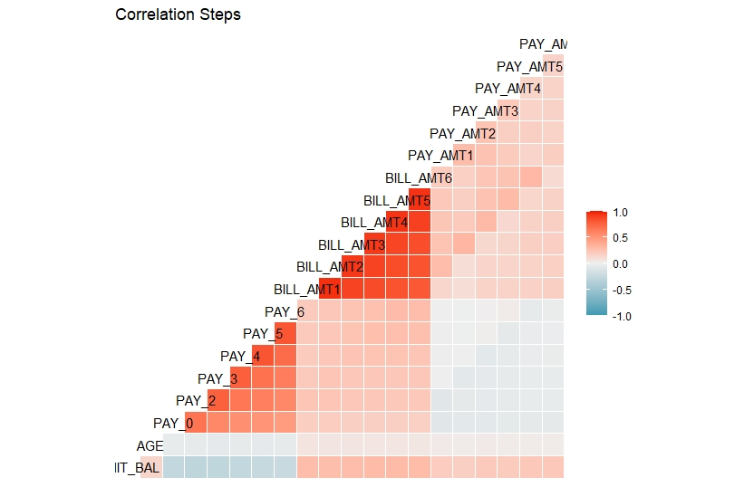

# **Comparative Study of Classification Techniques on Credit Defaults**
### *A study of six data mining techniques into the Credit Card Defaulter Data -Taiwan (2005)*

#### *by,  Kousik Somodder,  Sagarnil Bose &  Shreyashi Saha*


## **Introduction**

This project is an attempt toward a comparative study among six different machine- learning models for their accuracy in 
predicting the target class as well as their accuracy for representing the real probability of an individual belonging to the actual 
class from the perspective of risk management using the *Sorting Smoothing Method*. In this project, we summoned the **“Default of credit card clients, Taiwan 2005”** 
dataset available at [UCI machine-learning repository](https://archive.ics.uci.edu/ml/datasets/default+of+credit+card+clients).


## **Objective**

The sole purpose of this project is to compare the six machine-learning models, namely *Logistic regression, Discriminant analysis, K-nearest neighbor, Support vector machine, XGBOOST and Artificial neural network* based on their accuracy of classification performane and effectiveness in representing the real probability of an individual belonging to the actual class.

 For assessment of classification accuracy, different measures such as classification error rate from confusion matrix, ROC curve and area under curve (AUC) are employed. For the assessment of accuracy of predicted probabilities, we’ll use the scatter plot of real probabilities of default(Y) vs predicted probability of default(x) from each of the six techniques. Then fit a linear regression line Y=A+Bx from the scatter plot and decide the best predicting model for which A is closest to 0 and B is closest to 1 and Rsq is highest.
 
 
## **About The Data Set**

Our dataset *‘Default of credit card clients’* consists of informations about transactions from April 2005 to September 2005 of 30000 clients who were credit holders in a bank in Taiwan. This dataset has binary response variable ‘default.payment.next.month’ that takes the value 1 if the corresponding client has default payment and 0 otherwise. Out of 30000 clients 6636(22.12%) were with default payment. There are 23 other independent or explanatory variables:

* 	LIMIT_BAL: Amount of the given credit(NT dollar), it includes both the individual consumer credit as well as the person’s family credit
* 	SEX: 1=male and 2= female
* 	EDUCATION: 1= graduate school, 2= university,3=high-school , 4=others
* 	MARRIAGE: Marital status. 1=married,2=single, 3= others
* 	AGE: Age of the client
* 	PAY_1-PAY_6: History of past payments from April to September 2005. Like PAY_1=The repayment status in September, …., PAY_6=The repayment status of April 2005. The scaling of the status is as follows -2= no transactions history,-1=paid duly,0=revolving ,1=payment delay for one month ,2= payment delay for 2 months ,….,9=payment delay for 9 months or more.
*	 BILL_AMT1-BILL_AMT6: Amount of bill statement (NT dollar). BILL_AMT1=amount of bill statement in September  ,…., BILL_AMT6= amount of bill statement in April 2005.
* 	PAY_AMT1-PAY_AMT6:Amount of previous payment(NT dollar).PAY_AMT1=amount paid in September ,…., PAY_AMT6=amount paid in April 2005.

 
## **Content List**

1.	Loading required packages into the session
1.	Reading the data into the session
1.	Having a look at the data, its structure and summary
1.	Visualization
1.	Feature engineering 
1.	Data preprocessing and test-train split of the data
1.	Model fitting 
1.	Prediction on training and test set and computing error rate and AUC
1.	Plotting ROC curves and cumulative lift charts
1.	Sorting smoothing method 
1.	Scatter plot and linear regression line fitting and comparison study for the models
1.	Conclusion  


## **Let’s get started!**  

#### **_Loading Packages_**  


 
 We’ll load some packages into the session first, required in this project. Such as *data.table, dplyr* for data importing and wrangling, *ggplot2, cowplot, pROC,ROCR* for visualization of data and diagonistic plotting, *caret* for models training and several other packages, using `library()` function. If the package is not installed then it has to be installed using `install.packages("package name")`. In our case, we have our packages installed, we just need bring them into our session.
 
 ```Rscript
##Loading the required libraries

library(data.table)
library(ggplot2)
library(psych)
library(GGally)
library(dplyr)
library(cowplot)
library(caret)
library(pROC)
library(ROCR)
library(MASS)
library(dummies)
library(class)
library(xgboost)
library(e1071)
library(nnet)

 ```
 
 We’ll read the data ‘Default of credit card client’ in as a csv file into an object named as credit.
 
 ```{r}
##Reading the data in R session
credit=fread("default of credit card clients.csv")
```
Let’s take a look at how the first few rows look like as well as the structures of the variables.
```{r}
##Having a look at the data 
str(credit)
head(credit)
```  


```{r}
Classes ‘data.table’ and 'data.frame':	30000 obs. of  25 variables:
 $ ID                        : int  1 2 3 4 5 6 7 8 9 10 ...
 $ LIMIT_BAL                 : int  20000 120000 90000 50000 50000 50000 500000 100000 140000 20000 ...
 $ SEX                       : int  2 2 2 2 1 1 1 2 2 1 ...
 $ EDUCATION                 : int  2 2 2 2 2 1 1 2 3 3 ...
 $ MARRIAGE                  : int  1 2 2 1 1 2 2 2 1 2 ...
 $ AGE                       : int  24 26 34 37 57 37 29 23 28 35 ...
 $ PAY_0                     : int  2 -1 0 0 -1 0 0 0 0 -2 ...
 $ PAY_2                     : int  2 2 0 0 0 0 0 -1 0 -2 ...
 $ PAY_3                     : int  -1 0 0 0 -1 0 0 -1 2 -2 ...
 $ PAY_4                     : int  -1 0 0 0 0 0 0 0 0 -2 ...
 $ PAY_5                     : int  -2 0 0 0 0 0 0 0 0 -1 ...
 $ PAY_6                     : int  -2 2 0 0 0 0 0 -1 0 -1 ...
 $ BILL_AMT1                 : int  3913 2682 29239 46990 8617 64400 367965 11876 11285 0 ...
 $ BILL_AMT2                 : int  3102 1725 14027 48233 5670 57069 412023 380 14096 0 ...
 $ BILL_AMT3                 : int  689 2682 13559 49291 35835 57608 445007 601 12108 0 ...
 $ BILL_AMT4                 : int  0 3272 14331 28314 20940 19394 542653 221 12211 0 ...
 $ BILL_AMT5                 : int  0 3455 14948 28959 19146 19619 483003 -159 11793 13007 ...
 $ BILL_AMT6                 : int  0 3261 15549 29547 19131 20024 473944 567 3719 13912 ...
 $ PAY_AMT1                  : int  0 0 1518 2000 2000 2500 55000 380 3329 0 ...
 $ PAY_AMT2                  : int  689 1000 1500 2019 36681 1815 40000 601 0 0 ...
 $ PAY_AMT3                  : int  0 1000 1000 1200 10000 657 38000 0 432 0 ...
 $ PAY_AMT4                  : int  0 1000 1000 1100 9000 1000 20239 581 1000 13007 ...
 $ PAY_AMT5                  : int  0 0 1000 1069 689 1000 13750 1687 1000 1122 ...
 $ PAY_AMT6                  : int  0 2000 5000 1000 679 800 13770 1542 1000 0 ...
 $ default payment next month: int  1 1 0 0 0 0 0 0 0 0 ...
 - attr(*, ".internal.selfref")=<externalptr> 
```  

```{r}
 LIMIT_BAL SEX EDUCATION MARRIAGE AGE PAY_0 PAY_2 PAY_3 PAY_4 PAY_5 PAY_6 BILL_AMT1 BILL_AMT2
1:     20000   2         2        1  24     2     2    -1    -1    -2    -2      3913      3102
2:    120000   2         2        2  26    -1     2     0     0     0     2      2682      1725
3:     90000   2         2        2  34     0     0     0     0     0     0     29239     14027
4:     50000   2         2        1  37     0     0     0     0     0     0     46990     48233
5:     50000   1         2        1  57    -1     0    -1     0     0     0      8617      5670
6:     50000   1         1        2  37     0     0     0     0     0     0     64400     57069

 BILL_AMT3 BILL_AMT4 BILL_AMT5 BILL_AMT6 PAY_AMT1 PAY_AMT2 PAY_AMT3 PAY_AMT4 PAY_AMT5 PAY_AMT6
1:       689         0         0         0        0      689        0        0        0        0
2:      2682      3272      3455      3261        0     1000     1000     1000        0     2000
3:     13559     14331     14948     15549     1518     1500     1000     1000     1000     5000
4:     49291     28314     28959     29547     2000     2019     1200     1100     1069     1000
5:     35835     20940     19146     19131     2000    36681    10000     9000      689      679
6:     57608     19394     19619     20024     2500     1815      657     1000     1000      800

   default payment next month
1:                          1
2:                          1
3:                          0
4:                          0
5:                          0
6:                          0
```
The column ‘id’ has no role to play in our analysis. Hence, it is omitted.  

 ```{r}
 ##Droping the unnecessary variable/column
credit=credit[,-1]#There's no use of the column id in our analysis
 ```  
 
Let’s inspect for missing values and converting the variables SEX, EDUCATION, MARRIAGE, and default.payment.next.month in factor variables

```{r}
##Looking for missing value
sum(is.na(credit))#it is observed that there's no missing values

##Changing the name of the variable PAY_0 to PAY_1 and default payment to target
names(credit)
names(credit)[6]="PAY_1"

##Transforming the variables SEX,MARRIAGE,EDUCATION and default payment variables into factors

df=as.data.frame(credit)
df[c("SEX","MARRIAGE","EDUCATION","default payment next month")]=lapply(df[c("SEX","MARRIAGE","EDUCATION","default payment next month")]
                                                                        ,function(x) as.factor(x))

credit=df
rm(df)
```

The overall summary of the variables, quantitative as well as qualitative.


```{r}
##Extended data dictionary
summary(credit)
```
 
 ```{r}
   LIMIT_BAL       SEX       EDUCATION MARRIAGE       AGE            PAY_1             PAY_2             PAY_3             PAY_4        
 Min.   :  10000   1:11888   0:  468   3:  377   Min.   :21.00   Min.   :-2.0000   Min.   :-2.0000   Min.   :-2.0000   Min.   :-2.0000  
 1st Qu.:  50000   2:18112   1:10585   1:13659   1st Qu.:28.00   1st Qu.:-1.0000   1st Qu.:-1.0000   1st Qu.:-1.0000   1st Qu.:-1.0000  
 Median : 140000             2:14030   2:15964   Median :34.00   Median : 0.0000   Median : 0.0000   Median : 0.0000   Median : 0.0000  
 Mean   : 167484             3: 4917             Mean   :35.49   Mean   :-0.0167   Mean   :-0.1338   Mean   :-0.1662   Mean   :-0.2207  
 3rd Qu.: 240000                                 3rd Qu.:41.00   3rd Qu.: 0.0000   3rd Qu.: 0.0000   3rd Qu.: 0.0000   3rd Qu.: 0.0000  
 Max.   :1000000                                 Max.   :79.00   Max.   : 8.0000   Max.   : 8.0000   Max.   : 8.0000   Max.   : 8.0000  
     PAY_5             PAY_6           BILL_AMT1         BILL_AMT2        BILL_AMT3         BILL_AMT4         BILL_AMT5     
 Min.   :-2.0000   Min.   :-2.0000   Min.   :-165580   Min.   :-69777   Min.   :-157264   Min.   :-170000   Min.   :-81334  
 1st Qu.:-1.0000   1st Qu.:-1.0000   1st Qu.:   3559   1st Qu.:  2985   1st Qu.:   2666   1st Qu.:   2327   1st Qu.:  1763  
 Median : 0.0000   Median : 0.0000   Median :  22382   Median : 21200   Median :  20089   Median :  19052   Median : 18105  
 Mean   :-0.2662   Mean   :-0.2911   Mean   :  51223   Mean   : 49179   Mean   :  47013   Mean   :  43263   Mean   : 40311  
 3rd Qu.: 0.0000   3rd Qu.: 0.0000   3rd Qu.:  67091   3rd Qu.: 64006   3rd Qu.:  60165   3rd Qu.:  54506   3rd Qu.: 50191  
 Max.   : 8.0000   Max.   : 8.0000   Max.   : 964511   Max.   :983931   Max.   :1664089   Max.   : 891586   Max.   :927171  
   BILL_AMT6          PAY_AMT1         PAY_AMT2          PAY_AMT3         PAY_AMT4         PAY_AMT5           PAY_AMT6       
 Min.   :-339603   Min.   :     0   Min.   :      0   Min.   :     0   Min.   :     0   Min.   :     0.0   Min.   :     0.0  
 1st Qu.:   1256   1st Qu.:  1000   1st Qu.:    833   1st Qu.:   390   1st Qu.:   296   1st Qu.:   252.5   1st Qu.:   117.8  
 Median :  17071   Median :  2100   Median :   2009   Median :  1800   Median :  1500   Median :  1500.0   Median :  1500.0  
 Mean   :  38872   Mean   :  5664   Mean   :   5921   Mean   :  5226   Mean   :  4826   Mean   :  4799.4   Mean   :  5215.5  
 3rd Qu.:  49198   3rd Qu.:  5006   3rd Qu.:   5000   3rd Qu.:  4505   3rd Qu.:  4013   3rd Qu.:  4031.5   3rd Qu.:  4000.0  
 Max.   : 961664   Max.   :873552   Max.   :1684259   Max.   :896040   Max.   :621000   Max.   :426529.0   Max.   :528666.0  
 default payment next month
 0:23364                   
 1: 6636           
 ```  
 
## **_Bivariate analysis_**

Now we’ll scrutinize the correlations between the quantitative variables and will check if there are high correlation between some of the features. We employ correlation step plot.

```{r}
##Correlation analysis and Correlogram plot

df=credit[,c(-2:-4,-24)] #Considering only quantitative variables
#cor(credit[,c(-2:-4,-24)])
#ggpairs(df,aes(color=credit$`default payment next month`),title = "Correlogram")
ggcorr(df,method=c("everything", "pearson"))+ggtitle("Correlation Steps")
rm(df)
```



It can be observed that the correlation among the bill amounts for 6 months are on the higher side. All other features have low or moderate correlation among them. 
 
## **_Visualizations_**

We’ll now dive into the visualizations of the dataset in hand. Several  plots like density plot for credit amount , histogram of age, several bar-plots for marital status and gender also dot-plots for credit amount versus payment statuses( PAY_1 ,..,PAY_6) and bill amounts (BILL_AMT1 ,….,BILL_AMT6).

```{r}
##Visualizing the data

ggplot(credit,aes(x=credit$LIMIT_BAL,fill=credit$`default payment next month`))+
      geom_density(alpha=0.6,show.legend = T,color="blue")+
      ggtitle("Density plot oh Credit Amount")+
      xlab("Credit Amount")

#We see Customers with relatively lower credit amount tend to be defualt for payment

ggplot(credit,aes(x=credit$AGE,fill=credit$`default payment next month`))+
  geom_histogram(show.legend = T,alpha=0.9)+
  ggtitle("AGE for different customers with respect to default")+
  xlab("AGE")
#Customers with age between 20-35 have relatively higher no of defaults

ggplot(credit,aes(x=credit$MARRIAGE,group=credit$`default payment next month`))+
  geom_bar(show.legend = T,fill="lightblue")+
  ggtitle("Default for different marital status")+
  xlab("Marriage")+
  facet_grid(~credit$`default payment next month`)

#No of default is slightly higher for married customers

ggplot(credit,aes(x=credit$SEX,fill=credit$`default payment next month`))+
  geom_bar(aes(y=(..count..)/sum(..count..)), show.legend = T)+
  ggtitle("Default for different gender")+
  xlab("SEX")+
  ylab("proportion")

# Proportion of default is greater for female compared to male.

p=list()#creating empty plot list

for(i in 12:17){
  p[[i]]= ggplot(credit,aes(x=credit[,1],y=credit[,i],color=credit$`default payment next month`))+
    geom_point(show.legend = T)+xlab("Limit_Bal")+ylab(paste0("Bill_Amt",i-11,sep=""))+ggtitle(paste0("Limit_bal vs Bill_amt",i-11,sep=""))
  
}

plot_grid(p[[12]],p[[13]],p[[14]],p[[15]],p[[16]],p[[17]],nrow=3,ncol=2)

#There's a cluster of default cusromers in the lower range of limit balalace and Bill amounts

q=list()#creating empty plot list

for(i in 6:11){
  q[[i]]=ggplot(credit,aes(x=credit[,i],y=credit[,1],color=credit$`default payment next month`,palette="jco"))+
    geom_point(show.legend = T)+xlab(paste0("PAY_",i-5,sep=""))+ylab("Limit Bal")+
    ggtitle(paste0("PAY_",i-5,"Vs Limit Bal",sep=""))
}

plot_grid(q[[6]],q[[7]],q[[8]],q[[9]],q[[10]],q[[11]],nrow=3,ncol=2)

#Most of the default customers have delays in repayment status

```


 
 
 
 
 
 
 


 
 ## **_Observations_**
 
 The density of credit amount is high in the range 0 to 250000 for the clients with default of payment. Therefore, clients with relatively lower credit are more likely to be default. Similarly, from the histogram of age it is clear that most of the default clients are in the age bracket 20 to 40.
 
The proportions of females are greater than that of males for default and non- default clients. In case of defaults the no of married clients and single clients are almost same but in case of non-default clients, unmarried clients comprehensively outnumber the married ones.

The dot-plots of credit amount versus repayment statuses indicates that those who are allowed high amount of credit are able to clear their bills duly and clients with low credit amounts are the majority in defaults, which is expected. There is a kind of barrier at 500000 for credit amount and most of the clients are have allowed credit within the range 0 to 500000.

Clients with positive repayment statuses are majority of defaults which is also a very obvious fact.

## **_Feature engineering_**

There are some undocumented labels in the factor variables like EDUCATION and MARRIAGE. For example, the labels 4, 5 and 6 of EDUCATION are not documented clearly in the description of the dataset, so we merge these labels with the label 0 that implies qualification other than high school, graduate and university.

Similarly, we merge the labels 0 and 3 for MARRIAGE factor.As 3 implies divorce and 0 is other.
These changes are appearing reasonable to me due to the updates in the definition of the variables in the discussion zone for this dataset in [Kaggle by ezboral](https://www.kaggle.com/uciml/default-of-credit-card-clients-dataset/discussion/34608).

 ```{r}
 ## Feature Engineering

##Redefining the variables EDUCATIOn,Marriage according to the revised description of the dataset.
credit$EDUCATION = recode_factor(credit$EDUCATION, '4' = "0", '5' = "0", '6' = "0",.default = levels(credit$EDUCATION))
#table(credit$EDUCATION)

credit$MARRIAGE = recode_factor(credit$MARRIAGE, '0'="3",.default = levels(credit$MARRIAGE))
#table(credit$MARRIAGE)
```

Of course there are scopes to go deeper into engineering more features like variable transformations, important variables selection etc. However, these are good when working with one or two models based on their criteria for good fit, but in study of a good no of models too much upgradation in features may lead to misleading results. Therefore, we won’t indulge in any further engineering.
 
## **_Data pre-processing_**

First converting the repayment statuses PAY_1 to PAY_6 into factor variables and storing the ‘default.payment.next.month’ in a factor object, named ‘target’.

```{r}
df=as.data.frame(credit)
df[c("PAY_1","PAY_2","PAY_3","PAY_4","PAY_5","PAY_6")]= lapply(df[c("PAY_1","PAY_2","PAY_3","PAY_4","PAY_5","PAY_6")]
                                                                        ,function(x) as.factor(x))

credit=df
rm(df)
target=credit$`default payment next month`
(table(target)/length(target))
```
 
```{r}
target
     0      1 
0.7788 0.2212
``` 

We divide the whole data into two parts, quantitative and qualitative for future reference and one hot encoding (dummy encoding). 

```{r}
##Partitioning the whole data in quantitative and qualitative parts and defining the target
quanti=credit[,c(-2:-4,-6:-11,-24)]
quali=credit[,c(2:4,6:11)]
```
 
Then combine all the features quantitative and qualitative into one single data-frame.

```{r}
all.features=cbind(quanti,quali,target)
head(all.features)
```

```{r}
   LIMIT_BAL AGE BILL_AMT1 BILL_AMT2 BILL_AMT3 BILL_AMT4 BILL_AMT5 BILL_AMT6 PAY_AMT1 PAY_AMT2 PAY_AMT3 PAY_AMT4
1:     20000  24      3913      3102       689         0         0         0        0      689        0        0
2:    120000  26      2682      1725      2682      3272      3455      3261        0     1000     1000     1000
3:     90000  34     29239     14027     13559     14331     14948     15549     1518     1500     1000     1000
4:     50000  37     46990     48233     49291     28314     28959     29547     2000     2019     1200     1100
5:     50000  57      8617      5670     35835     20940     19146     19131     2000    36681    10000     9000
6:     50000  37     64400     57069     57608     19394     19619     20024     2500     1815      657     1000
   PAY_AMT5 PAY_AMT6 SEX EDUCATION MARRIAGE PAY_1 PAY_2 PAY_3 PAY_4 PAY_5 PAY_6 target
1:        0        0   2         2        1     2     2    -1    -1    -2    -2      1
2:        0     2000   2         2        2    -1     2     0     0     0     2      1
3:     1000     5000   2         2        2     0     0     0     0     0     0      0
4:     1069     1000   2         2        1     0     0     0     0     0     0      0
5:      689      679   1         2        1    -1     0    -1     0     0     0      0
6:     1000      800   1         1        2     0     0     0     0     0     0      0
```
We will define a few empty numeric variables, which will be used for comparison of the models.
 
```{r}
err1=numeric()
err2=numeric() #Creating empty vectors for further comparisons
auc1=numeric()
auc2=numeric()
```
 
## **_Test-train split of the data_**

We split the combined data-frame(or data-table) into two parts. One is training set, consists of 80% of the data, on which the model(s) will be trained and the other one is test set, consists of remaining 20% of the data, on which the model(s) will be validated.

```{r}
#Splitting the into test and train sets in 80:20 ratio

set.seed(666)#for reproducability of result
ind=sample(nrow(all.features),24000,replace = F)

train.logit=all.features[ind,]
test.logit=all.features[-ind,]
```

## **_Model fitting_**

For each of the six models we’ll perform the task according to the following template:
* Training the model on the training set(tuning the hyper-parameters if needed)
*	Making prediction on both train and test set
*	Calculate error rate for both the sets and store them in two vector
*	Plotting ROC curve for both the sets and store the area under curve(AUC) in two vectors
*	Lastly plot a cumulative gain chart for test set. 

## **_Logistic Regression_**

Logistic regression is a binary classification algorithm used to model the probability of an individual belonging to a class. Generally a binary response variable with two category (in our case default payment) denoted by ‘0’ and ‘1’ is regressed by logistic regression. In logistic model, the log of odds of the binary response to be ‘1’ is predicted by a linear regression equation that can include continuous as well as factor variables. However, the factor variables are needed to be encoded as one indicator variable for each label. The corresponding predicted probability of the value labeled as ‘1’ is converted to the class ‘1’ or ‘0’ by using threshold value.

```{r}
##Fitting a logistic model##

model.logit=glm(target~.,data=train.logit,family="binomial")

summary(model.logit)

#For test set
pred.logit=predict(model.logit,type="response",newdata = test.logit)

pred.def=ifelse(pred.logit>0.5,"1","0")

conf1=table(predict=pred.def,true=test.logit$target)
err2[1]= 1 - sum(diag(conf1))/sum(conf1)

#For training set
pred.def=ifelse(predict(model.logit,type="response",newdata = train.logit)>0.5,"1","0")

conf1.train=table(predict=pred.def,true=train.logit$target)
err1[1]= 1 - sum(diag(conf1.train))/sum(conf1.train)

##Ploting ROC curve and AUC for test and train set

par(mfrow=c(1,2))
par(pty="s")

#For training set
roc(train.logit$target,model.logit$fitted.values,plot=T,col="#69b3a2",print.auc=T,legacy.axes=TRUE,percent = T,
    xlab="False Positive percentage",ylab="True Positive percentage",lwd=5,main="Train Set")

#For test set
roc(test.logit$target,pred.logit,plot=T,col="navyblue",print.auc=T,legacy.axes=TRUE,percent = T,
    xlab="False Positive percentage",ylab="True Positive percentage",lwd=5,main="Test Set")
```

```{r}
auc1[1]=0.772
auc2[1]=0.769
```

## **_Linear Discriminant Analysis_**

Linear discriminant analysis is a generalized version of Fisher’s discriminant rule. This method is also used in machine learning for classification problem. This model specifies that for each given class of response variable the posterior probability of a sample given the class follows multivariate normal distribution with common variance-covariance matrix. LDA also use linear combination of features for discriminating the different categories of the response variable and its objective is to maximize the distance between different categories and minimizing the distance within each category.
 Besides the formula and training data, one more parameter prior is passed to the function lda(). *prior* is a vector specifying the prior probabilities of class membership. We will use the proportion of the classes in our dataset as our input.

```{r}
##Fitting a Linear discriminent model ##

model.lda=lda(target~.,data=train.logit,prior=c(0.7788,0.2212))
model.lda

#For test set
pred.lda=predict(model.lda,test.logit)

data.frame(pred.lda$posterior)
pred.lda.prob=pred.lda$posterior[,2]

conf2=table(predict=pred.lda$class,true=test.logit$target)
err2[2]= 1 - sum(diag(conf2))/sum(conf2)

#For train set
pred.lda.train=predict(model.lda,train.logit)
data.frame(pred.lda.train$posterior)

conf2.train=table(predict=pred.lda.train$class,true=train.logit$target)
err1[2]= 1 - sum(diag(conf2.train))/sum(conf2.train)

##Ploting ROC curve and AUC for test and train set

par(mfrow=c(1,2))
par(pty="s")

roc(train.logit$target,pred.lda.train$posterior[,2],plot=T,col="#69b3a2",print.auc=T,legacy.axes=TRUE,percent = T,
    xlab="False Positive percentage",ylab="True Positive percentage",lwd=5,main="Train Set")

roc(test.logit$target,pred.lda.prob,plot=T,col="navyblue",print.auc=T,legacy.axes=TRUE,percent = T,
    xlab="False Positive percentage",ylab="True Positive percentage",lwd=5,main="Test Set")
```


```{r}
auc1[2]=0.770
auc2[2]=0.768
```

## **_K-Nearest Neighbor_**

K-nearest neighbor is a non-parametric algorithm that can be used in classification problem. For a given sample a *KNN* classifier search for the pattern in the neighborhood of the sample and assign the sample to the class closest to the sample. In *KNN* classification the output is a class membership and the output class is obtained from the majority of votes from the neighbors. Closeness of the class is defined by the distance between the sample and the neighbors.
The parameter *k* in the classifier is an integer, defines the no of member in the neighborhood to be considered. Here *k=1* implies the sample is assigned to the class of the single neighbor.
We will use a for-loop to check for a range of values of k for which the model produces highest accuracy.

```{r}
##FItting K Nearest Neighbor classifier ##

#Preprocessing the data

# min-max normalization of quantitative features
f=function(x)
{
 return((x-min(x))/(max(x)-min(x)))
}

quanti.norm=quanti

setDF(quanti.norm)#Converting into data.frame

for(i in 1:14){
quanti.norm[,i]=f(quanti.norm[,i]) #Normalization
}

#Dummy encoding for factor variables
quali.dummy=dummy.data.frame(quali)

#Merging the normalized data and encoded dummies
target=recode_factor(target,'0'="no",'1'="yes")

data.knn=cbind(quanti.norm,quali.dummy,target)

setDT(data.knn)#Converting into data.table

#Test train split in 80:20 ratio
set.seed(666) #For Reproducibility

ind=sample(nrow(data.knn),nrow(data.knn)*0.8,replace = F)
train.knn=data.knn[ind,]
test.knn=data.knn[-ind,]

trainy=train.knn$target

model.list=list()#empty list
v=numeric()

set.seed(222)
for(i in 1:30){
  
  model.list[[i]]=knn3(train.knn[,-88],trainy,k=i)
  tab=table(prediction=predict(model.list[[i]],test.knn[,-88],type = "class"),truth=test.knn$target)
  v[i]=sum(diag(tab)/sum(tab))
  
}
which.max(v)
plot(1:30,v,type="b",xlab="k",ylab="accuracy",main="Elbow plot",font.main=2,col="steelblue3",lwd=4)
abline(v=19,col="orange")
```

```{r}
model.knn=knn3(train.knn[,-88],trainy,k=19)#Best model in terms of accuracy

#Prediction
#Test set
set.seed(666)
conf3=table(prediction=predict(model.knn,test.knn[,-88],type = "class"),truth=test.knn$target)
err2[3]=1 - sum(diag(conf3))/sum(conf3)

knn.prob=predict(model.knn,test.knn[,-88],type="prob")[,2] #Probalities of "yes"

#Training set
set.seed(666)
conf3.train=table(prediction=predict(model.knn,train.knn[,-88],type = "class"),truth=train.knn$target)
err1[3]=1 - sum(diag(conf3.train))/sum(conf3.train)

##Ploting ROC curve and AUC for test and train set
par(mfrow=c(1,2))
par(pty="s")

roc(train.knn$target,predict(model.knn,train.knn[,-88],type="prob")[,2],plot=T,col="#69b3a2",print.auc=T,legacy.axes=TRUE,
    percent = T,xlab="False Positive percentage",ylab="True Positive percentage",lwd=5,main="Train Set")


roc(test.knn$target,knn.prob,plot=T,col="navyblue",print.auc=T,legacy.axes=TRUE,percent = T,
    xlab="False Positive percentage",ylab="True Positive percentage",lwd=5,main="Test Set")
```

```{r}
auc1[3]=0.814
auc2[3]=0.751
```


