# **Comparative Study of Classification Techniques on Credit Defaults**
### *A study of six data mining techniques into the Credit Card Defaulter Data -Taiwan (2005)*

#### *by,  Kousik Somodder,  Sagarnil Bose &  Shreyashi Saha*


## **Introduction**

This project is an attempt toward a comparative study among six different machine- learning models for their accuracy in 
predicting the target class as well as their accuracy for representing the real probability of an individual belonging to the actual 
class from the perspective of risk management using the *Sorting Smoothing Method*. In this project, we summoned the **“Default of credit card clients, Taiwan 2005”** 
dataset available at [UCI machine-learning repository](https://archive.ics.uci.edu/ml/datasets/default+of+credit+card+clients).


## **Objective**

The sole purpose of this project is to compare the six machine-learning models, namely *Logistic regression, Discriminant analysis, K-nearest neighbor, Support vector machine, XGBOOST and Artificial neural network* based on their accuracy of classification performane and effectiveness in representing the real probability of an individual belonging to the actual class.

 For assessment of classification accuracy, different measures such as classification error rate from confusion matrix, ROC curve and area under curve (AUC) are employed. For the assessment of accuracy of predicted probabilities, we’ll use the scatter plot of real probabilities of default(Y) vs predicted probability of default(x) from each of the six techniques. Then fit a linear regression line Y=A+Bx from the scatter plot and decide the best predicting model for which A is closest to 0 and B is closest to 1 and R²  is highest.
 
 
## **About The Data Set**

Our dataset *‘Default of credit card clients’* consists of informations about transactions from April 2005 to September 2005 of 30000 clients who were credit holders in a bank in Taiwan. This dataset has binary response variable ‘default.payment.next.month’ that takes the value 1 if the corresponding client has default payment and 0 otherwise. Out of 30000 clients 6636(22.12%) were with default payment. There are 23 other independent or explanatory variables:

* 	LIMIT_BAL: Amount of the given credit(NT dollar), it includes both the individual consumer credit as well as the person’s family credit
* 	SEX: 1=male and 2= female
* 	EDUCATION: 1= graduate school, 2= university,3=high-school , 4=others
* 	MARRIAGE: Marital status. 1=married,2=single, 3= others
* 	AGE: Age of the client
* 	PAY_1-PAY_6: History of past payments from April to September 2005. Like PAY_1=The repayment status in September, …., PAY_6=The repayment status of April 2005. The scaling of the status is as follows -2= no transactions history,-1=paid duly,0=revolving ,1=payment delay for one month ,2= payment delay for 2 months ,….,9=payment delay for 9 months or more.
*	 BILL_AMT1-BILL_AMT6: Amount of bill statement (NT dollar). BILL_AMT1=amount of bill statement in September  ,…., BILL_AMT6= amount of bill statement in April 2005.
* 	PAY_AMT1-PAY_AMT6:Amount of previous payment(NT dollar).PAY_AMT1=amount paid in September ,…., PAY_AMT6=amount paid in April 2005.

 
## **Content List**

*	Loading required packages into the session
*	Reading the data into the session
*	Having a look at the data, its structure and summary
*	Visualization
*	Feature engineering 
*	Data preprocessing and test-train split of the data
*	Model fitting 
*	Prediction on training and test set and computing error rate and AUC
*	Plotting ROC curves and cumulative lift charts
*	Sorting smoothing method 
*	Scatter plot and linear regression line fitting and comparison study for the models
*	Conclusion  


## **Let’s get started!**  

#### **_Loading Packages_**  


 
 We’ll load some packages into the session first, required in this project. Such as *data.table, dplyr* for data importing and wrangling, *ggplot2, cowplot, pROC,ROCR* for visualization of data and diagonistic plotting, *caret* for models training and several other packages, using `library()` function. If the package is not installed then it has to be installed using `install.packages("package name")`. In our case, we have our packages installed, we just need bring them into our session.
 
 ```Rscript
##Loading the required libraries

library(data.table)
library(ggplot2)
library(psych)
library(GGally)
library(dplyr)
library(cowplot)
library(caret)
library(pROC)
library(ROCR)
library(MASS)
library(dummies)
library(class)
library(xgboost)
library(e1071)
library(nnet)

 ```
 
 We’ll read the data ‘Default of credit card client’ in as a csv file into an object named as credit.
 
 ```{r}
##Reading the data in R session
credit=fread("default of credit card clients.csv")
```
Let’s take a look at how the first few rows look like as well as the structures of the variables.
```{r}
##Having a look at the data 
str(credit)
head(credit)
```  


```{r}
Classes ‘data.table’ and 'data.frame':	30000 obs. of  25 variables:
 $ ID                        : int  1 2 3 4 5 6 7 8 9 10 ...
 $ LIMIT_BAL                 : int  20000 120000 90000 50000 50000 50000 500000 100000 140000 20000 ...
 $ SEX                       : int  2 2 2 2 1 1 1 2 2 1 ...
 $ EDUCATION                 : int  2 2 2 2 2 1 1 2 3 3 ...
 $ MARRIAGE                  : int  1 2 2 1 1 2 2 2 1 2 ...
 $ AGE                       : int  24 26 34 37 57 37 29 23 28 35 ...
 $ PAY_0                     : int  2 -1 0 0 -1 0 0 0 0 -2 ...
 $ PAY_2                     : int  2 2 0 0 0 0 0 -1 0 -2 ...
 $ PAY_3                     : int  -1 0 0 0 -1 0 0 -1 2 -2 ...
 $ PAY_4                     : int  -1 0 0 0 0 0 0 0 0 -2 ...
 $ PAY_5                     : int  -2 0 0 0 0 0 0 0 0 -1 ...
 $ PAY_6                     : int  -2 2 0 0 0 0 0 -1 0 -1 ...
 $ BILL_AMT1                 : int  3913 2682 29239 46990 8617 64400 367965 11876 11285 0 ...
 $ BILL_AMT2                 : int  3102 1725 14027 48233 5670 57069 412023 380 14096 0 ...
 $ BILL_AMT3                 : int  689 2682 13559 49291 35835 57608 445007 601 12108 0 ...
 $ BILL_AMT4                 : int  0 3272 14331 28314 20940 19394 542653 221 12211 0 ...
 $ BILL_AMT5                 : int  0 3455 14948 28959 19146 19619 483003 -159 11793 13007 ...
 $ BILL_AMT6                 : int  0 3261 15549 29547 19131 20024 473944 567 3719 13912 ...
 $ PAY_AMT1                  : int  0 0 1518 2000 2000 2500 55000 380 3329 0 ...
 $ PAY_AMT2                  : int  689 1000 1500 2019 36681 1815 40000 601 0 0 ...
 $ PAY_AMT3                  : int  0 1000 1000 1200 10000 657 38000 0 432 0 ...
 $ PAY_AMT4                  : int  0 1000 1000 1100 9000 1000 20239 581 1000 13007 ...
 $ PAY_AMT5                  : int  0 0 1000 1069 689 1000 13750 1687 1000 1122 ...
 $ PAY_AMT6                  : int  0 2000 5000 1000 679 800 13770 1542 1000 0 ...
 $ default payment next month: int  1 1 0 0 0 0 0 0 0 0 ...
 - attr(*, ".internal.selfref")=<externalptr> 
```  

```{r}
 LIMIT_BAL SEX EDUCATION MARRIAGE AGE PAY_0 PAY_2 PAY_3 PAY_4 PAY_5 PAY_6 BILL_AMT1 BILL_AMT2
1:     20000   2         2        1  24     2     2    -1    -1    -2    -2      3913      3102
2:    120000   2         2        2  26    -1     2     0     0     0     2      2682      1725
3:     90000   2         2        2  34     0     0     0     0     0     0     29239     14027
4:     50000   2         2        1  37     0     0     0     0     0     0     46990     48233
5:     50000   1         2        1  57    -1     0    -1     0     0     0      8617      5670
6:     50000   1         1        2  37     0     0     0     0     0     0     64400     57069

 BILL_AMT3 BILL_AMT4 BILL_AMT5 BILL_AMT6 PAY_AMT1 PAY_AMT2 PAY_AMT3 PAY_AMT4 PAY_AMT5 PAY_AMT6
1:       689         0         0         0        0      689        0        0        0        0
2:      2682      3272      3455      3261        0     1000     1000     1000        0     2000
3:     13559     14331     14948     15549     1518     1500     1000     1000     1000     5000
4:     49291     28314     28959     29547     2000     2019     1200     1100     1069     1000
5:     35835     20940     19146     19131     2000    36681    10000     9000      689      679
6:     57608     19394     19619     20024     2500     1815      657     1000     1000      800

   default payment next month
1:                          1
2:                          1
3:                          0
4:                          0
5:                          0
6:                          0
```
The column ‘id’ has no role to play in our analysis. Hence, it is omitted.  

 ```{r}
## Droping the unnecessary variable/column
credit=credit[,-1]#There's no use of the column id in our analysis
 ```  
 
Let’s inspect for missing values. We rename of the PAY_0 and default payment next month column.

```{r}
##Looking for missing value
sum(is.na(credit))#it is observed that there's no missing values

##Changing the name of the variable PAY_0 to PAY_1
names(credit)
names(credit)[6]="PAY_1"
names(credit)[24] = "target"
```
Transforming the qualitative variables into factor variables in R as per the data description
```{r}
##Transforming the variables SEX,MARRIAGE,EDUCATION and default payment into factors
df=as.data.frame(credit)
df[c("SEX","MARRIAGE","EDUCATION","target","PAY_1","PAY_2","PAY_3","PAY_4","PAY_5","PAY_6")]= 
  lapply(df[c("SEX","MARRIAGE","EDUCATION","target","PAY_1","PAY_2","PAY_3","PAY_4","PAY_5","PAY_6")]
                                                                        ,function(x) as.factor(x))                                                                       


credit=df
rm(df)
```

The overall summary of the variables, quantitative as well as qualitative.


```{r}
##Extended data dictionary
summary(credit)
```
 
 ```{r}
  LIMIT_BAL       SEX       EDUCATION MARRIAGE       AGE            PAY_1           PAY_2      
 Min.   :  10000   1:11888   0:   14   0:   54   Min.   :21.00   0      :14737   0      :15730  
 1st Qu.:  50000   2:18112   1:10585   1:13659   1st Qu.:28.00   -1     : 5686   -1     : 6050  
 Median : 140000             2:14030   2:15964   Median :34.00   1      : 3688   2      : 3927  
 Mean   : 167484             3: 4917   3:  323   Mean   :35.49   -2     : 2759   -2     : 3782  
 3rd Qu.: 240000             4:  123             3rd Qu.:41.00   2      : 2667   3      :  326  
 Max.   :1000000             5:  280             Max.   :79.00   3      :  322   4      :   99  
                             6:   51                             (Other):  141   (Other):   86  
 
   PAY_3           PAY_4           PAY_5           PAY_6         BILL_AMT1         BILL_AMT2     
 0      :15764   0      :16455   0      :16947   0      :16286   Min.   :-165580   Min.   :-69777  
 -1     : 5938   -1     : 5687   -1     : 5539   -1     : 5740   1st Qu.:   3559   1st Qu.:  2985  
 -2     : 4085   -2     : 4348   -2     : 4546   -2     : 4895   Median :  22382   Median : 21200  
 2      : 3819   2      : 3159   2      : 2626   2      : 2766   Mean   :  51223   Mean   : 49179  
 3      :  240   3      :  180   3      :  178   3      :  184   3rd Qu.:  67091   3rd Qu.: 64006  
 4      :   76   4      :   69   4      :   84   4      :   49   Max.   : 964511   Max.   :983931  
 (Other):   78   (Other):  102   (Other):   80   (Other):   80                                     
   
   BILL_AMT3         BILL_AMT4         BILL_AMT5        BILL_AMT6          PAY_AMT1     
 Min.   :-157264   Min.   :-170000   Min.   :-81334   Min.   :-339603   Min.   :     0  
 1st Qu.:   2666   1st Qu.:   2327   1st Qu.:  1763   1st Qu.:   1256   1st Qu.:  1000  
 Median :  20089   Median :  19052   Median : 18105   Median :  17071   Median :  2100  
 Mean   :  47013   Mean   :  43263   Mean   : 40311   Mean   :  38872   Mean   :  5664  
 3rd Qu.:  60165   3rd Qu.:  54506   3rd Qu.: 50191   3rd Qu.:  49198   3rd Qu.:  5006  
 Max.   :1664089   Max.   : 891586   Max.   :927171   Max.   : 961664   Max.   :873552  
                                                                                        
    PAY_AMT2          PAY_AMT3         PAY_AMT4         PAY_AMT5           PAY_AMT6       
 Min.   :      0   Min.   :     0   Min.   :     0   Min.   :     0.0   Min.   :     0.0  
 1st Qu.:    833   1st Qu.:   390   1st Qu.:   296   1st Qu.:   252.5   1st Qu.:   117.8  
 Median :   2009   Median :  1800   Median :  1500   Median :  1500.0   Median :  1500.0  
 Mean   :   5921   Mean   :  5226   Mean   :  4826   Mean   :  4799.4   Mean   :  5215.5  
 3rd Qu.:   5000   3rd Qu.:  4505   3rd Qu.:  4013   3rd Qu.:  4031.5   3rd Qu.:  4000.0  
 Max.   :1684259   Max.   :896040   Max.   :621000   Max.   :426529.0   Max.   :528666.0  
                                                                                          
 target   
 0:23364  
 1: 6636  
 ```  
 
## **_Bivariate analysis_**

Now we’ll scrutinize the correlations between the quantitative variables and will check if there are high correlation between some of the features. We employ correlation step plot.

```{r}
##Correlation analysis and Correlogram plot

df=credit[,c(-2:-4,-24)] #Considering only quantitative variables
#cor(credit[,c(-2:-4,-24)])
#ggpairs(df,aes(color=credit$`default payment next month`),title = "Correlogram")
ggcorr(df,method=c("everything", "pearson"))+ggtitle("Correlation Steps")
rm(df)
```


It can be observed that the correlation among the bill amounts for 6 months are on the higher side. All other features have low or moderate correlation among them. 
 
## **_Visualizations_**

We’ll now dive into the visualizations of the dataset in hand. Several  plots like density plot for credit amount , histogram of age, several bar-plots for marital status and gender also dot-plots for credit amount versus payment statuses( PAY_1 ,..,PAY_6) and bill amounts (BILL_AMT1 ,….,BILL_AMT6).

```{r}
## Visualizing the data

ggplot(credit,aes(x=credit$LIMIT_BAL,fill=credit$target))+
      geom_density(alpha=0.6,show.legend = T,color="blue")+
      ggtitle("Density plot oh Credit Amount")+
      xlab("Credit Amount")
```

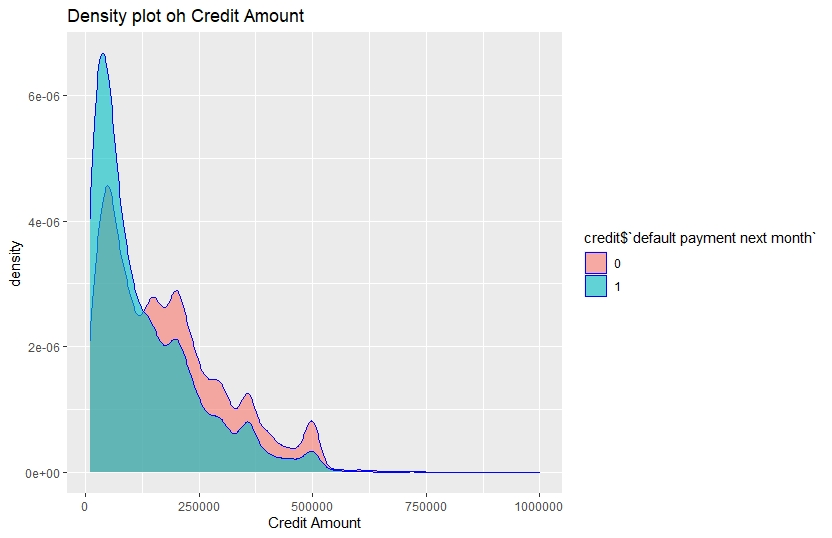  

We see Customers with relatively lower credit amount tend to be the defaulters

```{r}
ggplot(credit,aes(x=credit$AGE,fill=credit$target))+
  geom_histogram(show.legend = T,alpha=0.9)+
  ggtitle("AGE for different customers with respect to default")+
  xlab("AGE")
```

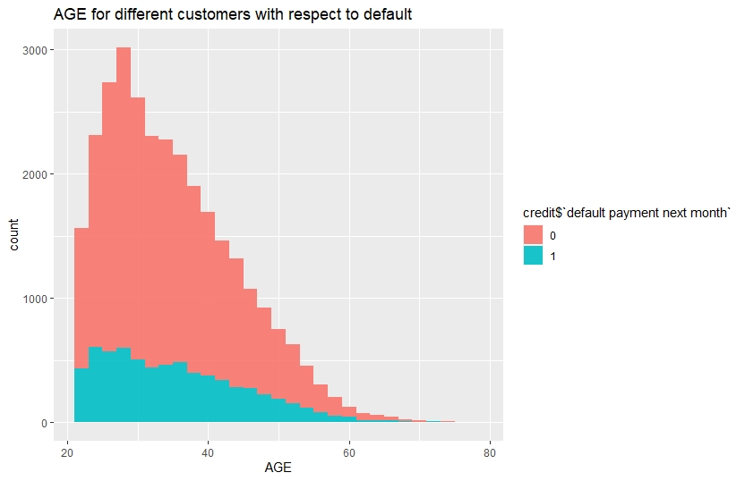   

Customers with age between 20-35 have relatively higher no of defaults

```{r}
ggplot(credit,aes(x=credit$MARRIAGE,group=credit$target))+
  geom_bar(show.legend = T,fill="lightblue")+
  ggtitle("Default for different marital status")+
  xlab("Marriage")+
  facet_grid(~credit$target)
```  
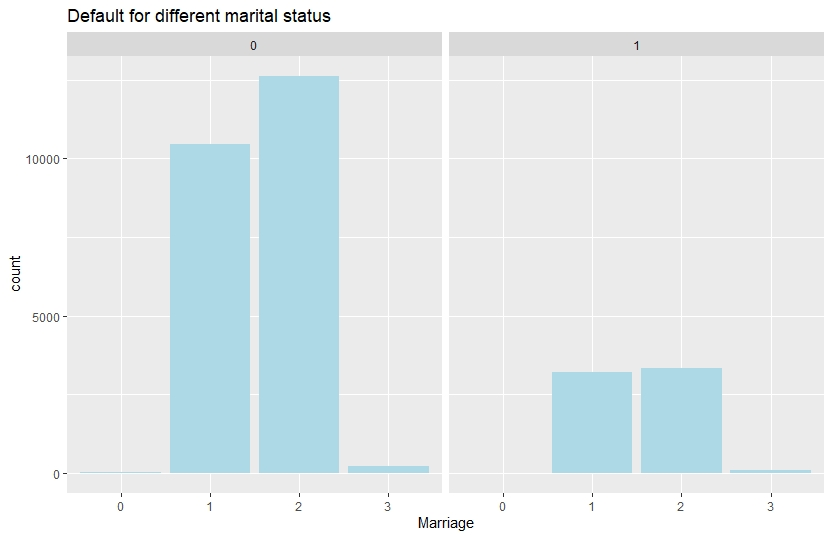  

No of default is slightly higher for married customers  

```{r}
ggplot(credit,aes(x=credit$SEX,fill=credit$target))+
  geom_bar(aes(y=(..count..)/sum(..count..)), show.legend = T)+
  ggtitle("Default for different gender")+
  xlab("SEX")+
  ylab("proportion")
```  
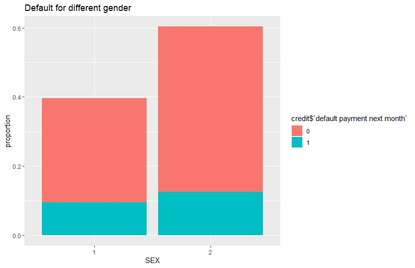  


Proportion of default is greater for female compared to male.
Now, we arrange the scatter plots of Limit Balance & Bill Amounts in a grid, colour coded in default payment status.

```{r}
p=list()                        #creating empty plot list
for(i in 12:17){
  p[[i]]= ggplot(credit,aes(x=credit[,1],y=credit[,i],color=credit$target))+
    geom_point(show.legend = T)+xlab("Limit_Bal")+ylab(paste0("Bill_Amt",i-11,sep=""))+ggtitle(paste0("Limit_bal vs Bill_amt",i-11,sep=""))
  
}

plot_grid(p[[12]],p[[13]],p[[14]],p[[15]],p[[16]],p[[17]],nrow=3,ncol=2)
```  
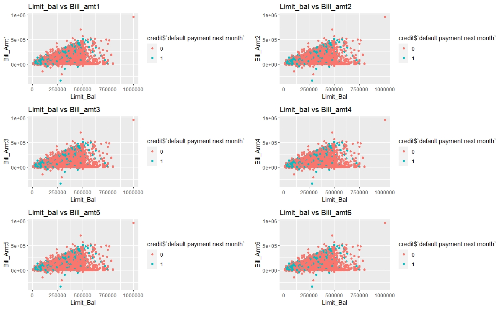

There's a cluster of default customers in the lower range of Limit Balalace and Bill amounts.  
We make another grid of scatter plots of Repayment Statuses with Limit Balance, colour coded in default payment status.

```{r}
q=list()             #creating empty plot list
for(i in 6:11){
  q[[i]]=ggplot(credit,aes(x=credit[,i],y=credit[,1],color=credit$target,palette="jco"))+
    geom_point(show.legend = T)+xlab(paste0("PAY_",i-5,sep=""))+ylab("Limit Bal")+
    ggtitle(paste0("PAY_",i-5,"Vs Limit Bal",sep=""))
}

plot_grid(q[[6]],q[[7]],q[[8]],q[[9]],q[[10]],q[[11]],nrow=3,ncol=2)
```  

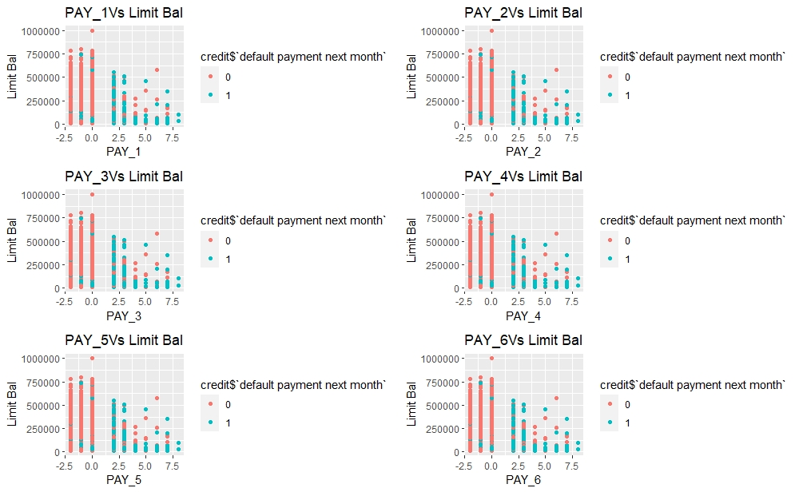  

 Most of the default customers have delays in repayment status

 
 ##  **_Observations_**
 
 The density of credit amount is high in the range 0 to 250000 for the clients with default of payment. Therefore, clients with relatively lower credit are more likely to be default. Similarly, from the histogram of age it is clear that most of the default clients are in the age bracket 20 to 40.
 
The proportions of females are greater than that of males for default and non- default clients. In case of defaults the no of married clients and single clients are almost same but in case of non-default clients, unmarried clients comprehensively outnumber the married ones.

The dot-plots of credit amount versus repayment statuses indicates that those who are allowed high amount of credit are able to clear their bills duly and clients with low credit amounts are the majority in defaults, which is expected. There is a kind of barrier at 500000 for credit amount and most of the clients are have allowed credit within the range 0 to 500000.

Clients with positive repayment statuses are majority of defaults which is also a very obvious fact.

## **_Feature engineering_**

There are some undocumented labels in the factor variables like EDUCATION and MARRIAGE. For example, the labels 4, 5 and 6 of EDUCATION are not documented clearly in the description of the dataset, so we merge these labels with the label 0 that implies qualification other than high school, graduate and university.

Similarly, we merge the labels 0 and 3 for MARRIAGE factor.As 3 implies divorce and 0 is other.
These changes are appearing reasonable to me due to the updates in the definition of the variables in the discussion zone for this dataset in [Kaggle by ezboral](https://www.kaggle.com/uciml/default-of-credit-card-clients-dataset/discussion/34608).

 ```{r}
 ## Feature Engineering

##Redefining the variables EDUCATIOn,Marriage according to the revised description of the dataset.
credit$EDUCATION = recode_factor(credit$EDUCATION, '4' = "0", '5' = "0", '6' = "0",.default = levels(credit$EDUCATION))
#table(credit$EDUCATION)

credit$MARRIAGE = recode_factor(credit$MARRIAGE, '0'="3",.default = levels(credit$MARRIAGE))
#table(credit$MARRIAGE)
```

Of course there are scopes to go deeper into engineering more features like variable transformations, important variables selection etc. However, these are good when working with one or two models based on their criteria for good fit, but in study of a good no of models too much upgradation in features may lead to misleading results. Therefore, we won’t indulge in any further engineering.
 
## **_Data pre-processing_**

First converting the repayment statuses PAY_1 to PAY_6 into factor variables and storing the ‘default.payment.next.month’ in a factor object, named ‘target’.

```{r}
df=as.data.frame(credit)
df[c("PAY_1","PAY_2","PAY_3","PAY_4","PAY_5","PAY_6")]= lapply(df[c("PAY_1","PAY_2","PAY_3","PAY_4","PAY_5","PAY_6")]
                                                                        ,function(x) as.factor(x))

credit=df
rm(df)
target=credit$`default payment next month`
(table(target)/length(target))
```
 
```{r}
target
     0      1 
0.7788 0.2212
``` 

We divide the whole data into two parts, quantitative and qualitative for future reference and one hot encoding (dummy encoding). 

```{r}
##Partitioning the whole data in quantitative and qualitative parts and defining the target
quanti=credit[,c(-2:-4,-6:-11,-24)]
quali=credit[,c(2:4,6:11)]
```
 
Then combine all the features quantitative and qualitative into one single data-frame.

```{r}
all.features=cbind(quanti,quali,target)
head(all.features)
```

```{r}
   LIMIT_BAL AGE BILL_AMT1 BILL_AMT2 BILL_AMT3 BILL_AMT4 BILL_AMT5 BILL_AMT6 PAY_AMT1 PAY_AMT2 PAY_AMT3 PAY_AMT4
1:     20000  24      3913      3102       689         0         0         0        0      689        0        0
2:    120000  26      2682      1725      2682      3272      3455      3261        0     1000     1000     1000
3:     90000  34     29239     14027     13559     14331     14948     15549     1518     1500     1000     1000
4:     50000  37     46990     48233     49291     28314     28959     29547     2000     2019     1200     1100
5:     50000  57      8617      5670     35835     20940     19146     19131     2000    36681    10000     9000
6:     50000  37     64400     57069     57608     19394     19619     20024     2500     1815      657     1000
   PAY_AMT5 PAY_AMT6 SEX EDUCATION MARRIAGE PAY_1 PAY_2 PAY_3 PAY_4 PAY_5 PAY_6 target
1:        0        0   2         2        1     2     2    -1    -1    -2    -2      1
2:        0     2000   2         2        2    -1     2     0     0     0     2      1
3:     1000     5000   2         2        2     0     0     0     0     0     0      0
4:     1069     1000   2         2        1     0     0     0     0     0     0      0
5:      689      679   1         2        1    -1     0    -1     0     0     0      0
6:     1000      800   1         1        2     0     0     0     0     0     0      0
```
We will define a few empty numeric variables, which will be used for comparison of the models.
 
```{r}
err1=numeric()
err2=numeric() #Creating empty vectors for further comparisons
auc1=numeric()
auc2=numeric()
```
 
## **_Test-train split of the data_**

We split the combined data-frame(or data-table) into two parts. One is training set, consists of 80% of the data, on which the model(s) will be trained and the other one is test set, consists of remaining 20% of the data, on which the model(s) will be validated.

```{r}
#Splitting the into test and train sets in 80:20 ratio

set.seed(666)#for reproducability of result
ind=sample(nrow(all.features),24000,replace = F)

train.logit=all.features[ind,]
test.logit=all.features[-ind,]
```

## **_Model fitting_**

For each of the six models we’ll perform the task according to the following template:
* Training the model on the training set(tuning the hyper-parameters if needed)
*	Making prediction on both train and test set
*	Calculate error rate for both the sets and store them in two vector
*	Plotting ROC curve for both the sets and store the area under curve(AUC) in two vectors
*	Lastly plot a cumulative gain chart for test set. 

## **_Logistic Regression_**

Logistic regression is a binary classification algorithm used to model the probability of an individual belonging to a class. Generally a binary response variable with two category (in our case default payment) denoted by ‘0’ and ‘1’ is regressed by logistic regression. In logistic model, the log of odds of the binary response to be ‘1’ is predicted by a linear regression equation that can include continuous as well as factor variables. However, the factor variables are needed to be encoded as one indicator variable for each label. The corresponding predicted probability of the value labeled as ‘1’ is converted to the class ‘1’ or ‘0’ by using threshold value.

```{r}
##Fitting a logistic model##

model.logit=glm(target~.,data=train.logit,family="binomial")

summary(model.logit)

#For test set
pred.logit=predict(model.logit,type="response",newdata = test.logit)

pred.def=ifelse(pred.logit>0.5,"1","0")

conf1=table(predict=pred.def,true=test.logit$target)
err2[1]= 1 - sum(diag(conf1))/sum(conf1)

#For training set
pred.def=ifelse(predict(model.logit,type="response",newdata = train.logit)>0.5,"1","0")

conf1.train=table(predict=pred.def,true=train.logit$target)
err1[1]= 1 - sum(diag(conf1.train))/sum(conf1.train)

##Ploting ROC curve and AUC for test and train set

par(mfrow=c(1,2))
par(pty="s")

#For training set
roc(train.logit$target,model.logit$fitted.values,plot=T,col="#69b3a2",print.auc=T,legacy.axes=TRUE,percent = T,
    xlab="False Positive percentage",ylab="True Positive percentage",lwd=5,main="Train Set")

#For test set
roc(test.logit$target,pred.logit,plot=T,col="navyblue",print.auc=T,legacy.axes=TRUE,percent = T,
    xlab="False Positive percentage",ylab="True Positive percentage",lwd=5,main="Test Set")
```
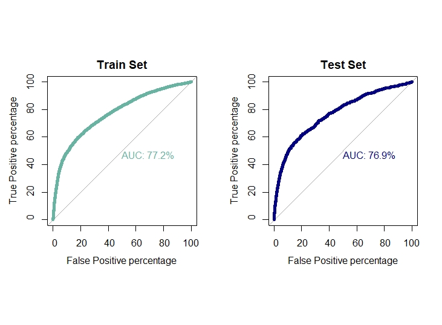
```{r}
auc1[1]=0.772
auc2[1]=0.769
```

## **_Linear Discriminant Analysis_**

Linear discriminant analysis is a generalized version of Fisher’s discriminant rule. This method is also used in machine learning for classification problem. This model specifies that for each given class of response variable the posterior probability of a sample given the class follows multivariate normal distribution with common variance-covariance matrix. LDA also use linear combination of features for discriminating the different categories of the response variable and its objective is to maximize the distance between different categories and minimizing the distance within each category.
 Besides the formula and training data, one more parameter prior is passed to the function lda(). *prior* is a vector specifying the prior probabilities of class membership. We will use the proportion of the classes in our dataset as our input.

```{r}
##Fitting a Linear discriminent model ##

model.lda=lda(target~.,data=train.logit,prior=c(0.7788,0.2212))
model.lda

#For test set
pred.lda=predict(model.lda,test.logit)

data.frame(pred.lda$posterior)
pred.lda.prob=pred.lda$posterior[,2]

conf2=table(predict=pred.lda$class,true=test.logit$target)
err2[2]= 1 - sum(diag(conf2))/sum(conf2)

#For train set
pred.lda.train=predict(model.lda,train.logit)
data.frame(pred.lda.train$posterior)

conf2.train=table(predict=pred.lda.train$class,true=train.logit$target)
err1[2]= 1 - sum(diag(conf2.train))/sum(conf2.train)

##Ploting ROC curve and AUC for test and train set

par(mfrow=c(1,2))
par(pty="s")

roc(train.logit$target,pred.lda.train$posterior[,2],plot=T,col="#69b3a2",print.auc=T,legacy.axes=TRUE,percent = T,
    xlab="False Positive percentage",ylab="True Positive percentage",lwd=5,main="Train Set")

roc(test.logit$target,pred.lda.prob,plot=T,col="navyblue",print.auc=T,legacy.axes=TRUE,percent = T,
    xlab="False Positive percentage",ylab="True Positive percentage",lwd=5,main="Test Set")
```
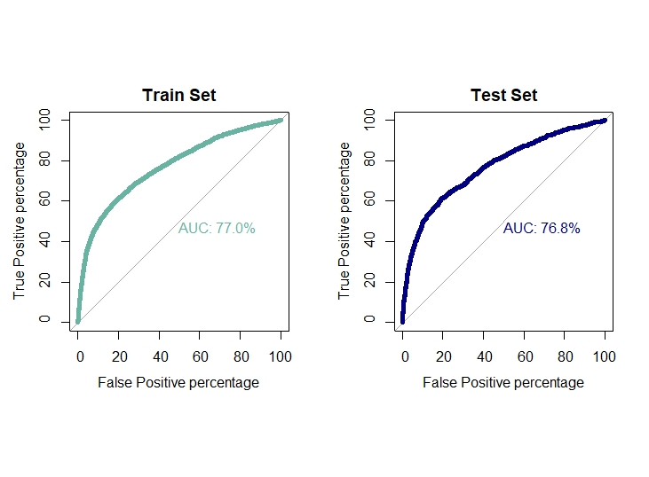

```{r}
auc1[2]=0.770
auc2[2]=0.768
```

## **_K-Nearest Neighbor_**

K-nearest neighbor is a non-parametric algorithm that can be used in classification problem. For a given sample a *KNN* classifier search for the pattern in the neighborhood of the sample and assign the sample to the class closest to the sample. In *KNN* classification the output is a class membership and the output class is obtained from the majority of votes from the neighbors. Closeness of the class is defined by the distance between the sample and the neighbors.
The parameter *k* in the classifier is an integer, defines the no of member in the neighborhood to be considered. Here *k=1* implies the sample is assigned to the class of the single neighbor.
We will use a for-loop to check for a range of values of k for which the model produces highest accuracy.

```{r}
##FItting K Nearest Neighbor classifier ##

#Preprocessing the data

# min-max normalization of quantitative features
f=function(x)
{
 return((x-min(x))/(max(x)-min(x)))
}

quanti.norm=quanti

setDF(quanti.norm)#Converting into data.frame

for(i in 1:14){
quanti.norm[,i]=f(quanti.norm[,i]) #Normalization
}

#Dummy encoding for factor variables
quali.dummy=dummy.data.frame(quali)

#Merging the normalized data and encoded dummies
target=recode_factor(target,'0'="no",'1'="yes")

data.knn=cbind(quanti.norm,quali.dummy,target)

setDT(data.knn)#Converting into data.table

#Test train split in 80:20 ratio
set.seed(666) #For Reproducibility

ind=sample(nrow(data.knn),nrow(data.knn)*0.8,replace = F)
train.knn=data.knn[ind,]
test.knn=data.knn[-ind,]

trainy=train.knn$target

model.list=list()#empty list
v=numeric()

set.seed(222)
for(i in 1:30){
  
  model.list[[i]]=knn3(train.knn[,-88],trainy,k=i)
  tab=table(prediction=predict(model.list[[i]],test.knn[,-88],type = "class"),truth=test.knn$target)
  v[i]=sum(diag(tab)/sum(tab))
  
}
which.max(v)
plot(1:30,v,type="b",xlab="k",ylab="accuracy",main="Elbow plot",font.main=2,col="steelblue3",lwd=4)
abline(v=19,col="orange")
```
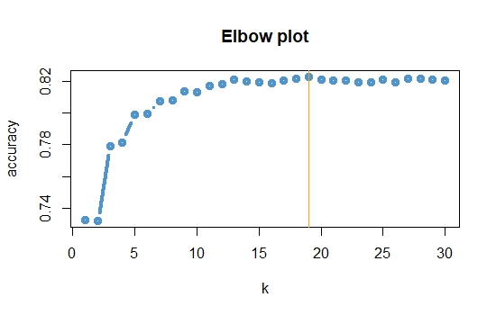
```{r}
model.knn=knn3(train.knn[,-88],trainy,k=19)#Best model in terms of accuracy

#Prediction
#Test set
set.seed(666)
conf3=table(prediction=predict(model.knn,test.knn[,-88],type = "class"),truth=test.knn$target)
err2[3]=1 - sum(diag(conf3))/sum(conf3)

knn.prob=predict(model.knn,test.knn[,-88],type="prob")[,2] #Probalities of "yes"

#Training set
set.seed(666)
conf3.train=table(prediction=predict(model.knn,train.knn[,-88],type = "class"),truth=train.knn$target)
err1[3]=1 - sum(diag(conf3.train))/sum(conf3.train)

##Ploting ROC curve and AUC for test and train set
par(mfrow=c(1,2))
par(pty="s")

roc(train.knn$target,predict(model.knn,train.knn[,-88],type="prob")[,2],plot=T,col="#69b3a2",print.auc=T,legacy.axes=TRUE,
    percent = T,xlab="False Positive percentage",ylab="True Positive percentage",lwd=5,main="Train Set")


roc(test.knn$target,knn.prob,plot=T,col="navyblue",print.auc=T,legacy.axes=TRUE,percent = T,
    xlab="False Positive percentage",ylab="True Positive percentage",lwd=5,main="Test Set")
```
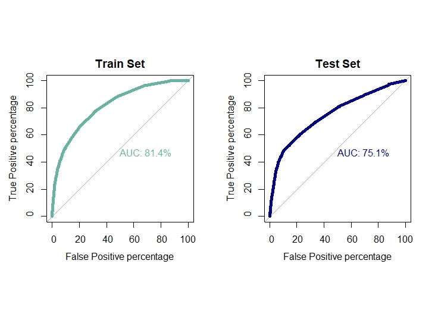
```{r}
auc1[3]=0.814
auc2[3]=0.751
```

## **_Extreme Gradient Boost_**

XGBoost is a supervised machine learning algorithm based on decision trees, an en that performs under gradient boosting framework. In boosting, the models are built sequentially by improving upon the errors from previous models. Gradient boosting algorithm on the other hand improve or minimize the error from previous models by employing gradient descent algorithm to give optimized weightage to the previously high performing models. Then comes XGBoost that is  similar to gradient boosting but uses a more regularized model by penalizing complex models using Ridge and Lasso regularization to prevent overfitting. For structured data this algorithm performs really well for its ability of parallel computing and sequential learning.

The wide range of hyper parameters is one of the main reason of flexibility of this model. Some of those parameters that have been used in our training are discussed below:
*	*objective*: The objective function used . Specify the learning task and the corresponding learning objective.
*	*booster*: which booster to use, can be gbtree or gblinear.
*	*eta*: control the learning rate: scale the contribution of each tree by a factor of 0 < eta < 1 when it is added to the current approximation. Used to prevent overfitting by making the boosting process more conservative. Lower value for eta implies larger value for nrounds: low eta value means model more robust to overfitting but slower to compute. 
*	*nrounds*: max number of boosting iterations.
*	*eval_metric*: evaluation metrics for validation data.
*	*max_depth*: maximum depth of a tree.
*	*colsample_bytree*: subsample ratio of columns when constructing each tree.
*	*subsample*: subsample ratio of the training instance. Setting it to 0.5 means that xgboost randomly collected half of the data instances to grow trees and this will prevent overfitting.
*	*min_child_weight*:  minimum sum of instance weight (hessian) needed in a child. If the tree partition step results in a leaf node with the sum of instance weight less than *min_child_weight*, then the building process will give up further partitioning. In linear regression mode, this simply corresponds to minimum number of instances needed to be in each node. The larger, the more conservative the algorithm will be. 
*	*gamma*: minimum loss reduction required to make a further partition on a leaf node of the tree. the larger, the more conservative the algorithm will be.
*	*early_stoping_rounds*:  the early stopping function is not triggered. If set to an integer k, training with a validation set will stop if the performance doesn't improve for k rounds.
*	*label*: vector of response values.

We will tune these parameters using caret package and ```train()``` function by enabling *parallel computing* to get the optimal values of the parameters that optimizes the chosen metric (accuracy or ROC).


```{r}
##FItting XGBoost classifier ##

set.seed(666)
library(parallel) 
# Calculate the number of cores
no_cores <- detectCores()-1

library(doParallel)
# create the cluster for caret to use
cl <- makePSOCKcluster(no_cores)
registerDoParallel(cl)

##Preprocessing the data for XGboost

target=as.numeric(recode_factor(target,'no'="0",'yes'="1"))
target=ifelse(target==1,0,1)#assiging 1 for default and 0 for non-default

data_xgb=cbind(quanti,quali.dummy,target)

#Test train split in 80:20 ratio
set.seed(666) #For Reproducibility

ind=sample(nrow(data_xgb),nrow(data_xgb)*0.8,replace = F)
train_xgb=data_xgb[ind,]
test_xgb=data_xgb[-ind,]

#Using caret package to tune the hyperparameters further
xgb_control=trainControl(method="cv",number = 3,allowParallel = T,
                         classProbs = T,summaryFunction = twoClassSummary)
xgb_grid=expand.grid(nrounds=seq(100,200,by=25),eta=c(0.08,0.09,seq(0.1,0.5,by=0.2)),max_depth=seq(2,6,by=1),gamma=c(0,0.5,1),
                     subsample=c(0.8,1),colsample_bytree=seq(0.8,1,by=0.1),min_child_weight=seq(1,3,by=1))
model.xgb=train(x=as.matrix(train_xgb[,-88]),y=recode_factor(as.factor(train_xgb$target),'0'="no",'1'="yes"),
                method="xgbTree",
                tuneGrid = xgb_grid
                ,trControl = xgb_control)

# model.xgb$bestTune

#The final model

set.seed(666)
xgb_param=trainControl(method="none",classProbs = T,summaryFunction = twoClassSummary,allowParallel = T)
model.xgb=train(x=as.matrix(train_xgb[,-88]),y=recode_factor(as.factor(train_xgb$target),'0'="no",'1'="yes"),
                method="xgbTree",verbose=T,
                tuneGrid = expand.grid(eta=0.08,nrounds=125,
                                       max_depth=6,colsample_bytree=0.9,gamma=0.5,
                                       min_child_weight=1,subsample=0.8)
                ,trControl = xgb_param)

stopCluster(cl)
registerDoSEQ()

#Prediction for train set
p_train=predict(model.xgb,newdata = as.matrix(train_xgb[,-88]))
conf4.train = table(predict=p_train,true=train_xgb$target)
err1[4] = (conf4.train[1,2]+conf4.train[2,1])/sum(conf4.train)

p_train_prob = predict(model.xgb,newdata = as.matrix(train_xgb[,-88]),type="prob")$yes

#Prediction for test set
p_test=predict(model.xgb,newdata = as.matrix(test_xgb[,-88]))
conf4 = table(predict=p_test,true=test_xgb$target)
err2[4]= (conf4[1,2]+conf4[2,1])/sum(conf4)

xgb.prob=predict(model.xgb,newdata = as.matrix(test_xgb[,-88]),type="prob")$yes

# ROC plot for train and test set
par(mfrow=c(1,2))
par(pty="s")

roc(response=as.factor(train_xgb$target),predictor=p_train_prob,percent = T,plot = T,col="#69b3a2",print.auc=T,
    legacy.axes=T,xlab="False Positive percentage",ylab="True Positive percentage",lwd=5,main="Train Set")

roc(response=as.factor(test_xgb$target),predictor=xgb.prob,percent = T,plot = T,col="navyblue",print.auc=T,
    legacy.axes=T,xlab="False Positive percentage",ylab="True Positive percentage",lwd=5,main="Test Set")
```
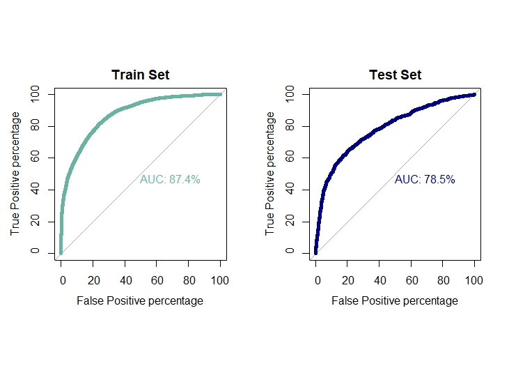
```{r}
auc1[4]=0.874
auc2[4]=0.785
```

## **_Kernel SVM_**

The Support Vector Machine (SVM) algorithm is a popular machine learning tool that offers solution for both classification and regression problems. Given a set of  training algorithms  builds a model  that assigns new  examples to one or  the other of two  categories , an SVM training  algorithm builds  a model  that  assigns   new examples to one  category  or the  other, making it  a non-probabilistic  binary  linear classifier. SVM model is a presentation of the examples as points in space, mapped so that the examples of the separate catagories are divided by a clear margin that is as wide as possible. New examples are then mapped into that same space and predicted to belong to a category based on the side of the margin on which they fall.

In addition to performing linear classification, SVMs can efficiently perform a non-linear classification using what is called the Kernel- trick, implicitly mapping their inputs into high dimensional feature spaces.  SVM  algorithm  use a  set  of  mathematical   function  that are defined as the  kernel . The function of kernel is to take data as input and transform it into the required form. Different SVM algorithms use different types of kernel functions, namely *linear, non-linear, polynomial, radial basis function (RBF), sigmoid*.Introduce Kernel functions for sequence data, graphs, texts, images as well as vectors. The most used type of Kernel function is RBF. Because it has localized and finite response along the entire x-axis.

SVM  Hyperparameter  tuning  using  GridSearch

A  Machine  Learning  model  is defined as  a  mathematical  model  with  a number   of  parameters that need  to be  learned from the data . However, there are some parameters, known as Hyperparameters.  SVM also has some hyperparameters (like what C or gamma (γ) values to use) and  finding optimal  hyperparameter  is a very hard task to  solve . The effectiveness of SVM depends  on the selection of Kernel’s parameter  C . A common choice is a Gaussian Kernel, which has a single  parameter  gamma (γ) . The best combination of C and gamma (γ) is often selected by Grid Search with exponentially growing sequences of C and ( ) . Typically, each combination of parameter choices is checked using cross-validation, and the parameters with best cross- validation accuracy are picked as the best tuned one.

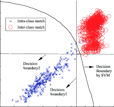
```{r}
##Fitting Support Vector Machines##

# Data_for_SVM
data.svm = cbind.data.frame(quanti.norm,quali,target) # SVM accepts factor variables
data.svm = setDT(data.svm)

# Splitting the data into 80:20 ratio
set.seed(666)
ind=sample(nrow(data.svm),nrow(data.svm)*0.8,replace = F)
train.svm=data.svm[ind,]
test.svm=data.svm[-ind,]

registerDoParallel(cl)

## Tuning Hyperparameters for SVM
SVM_Radial_Fit = train(target~.,train.svm, method = "svmRadial",verbose = F,
                       trControl = trainControl(method = "cv",
                                                number = 10,allowParallel = T))

stopCluster(cl)
registerDoSEQ()

#SVM_Radial_Fit$bestTune

# Model Fitting
set.seed(666)
model.svm = svm(target ~ .,data=train.svm,cost = 1, gamma = 0.1885286,
                type="C-classification",kernel="radial",
                probability = T)

# For test set
pred.svm = predict(model.svm,newdata = test.svm[,-24],probability = T)

pred.svm.prob = as.data.frame(attr(pred.svm,"prob"))[,2]

conf5 = table(predicted = pred.svm,true = test.svm$target)
err2[5] = 1 - sum(diag(conf5))/sum(conf5)

# For training set
pred.svm.train=predict(model.svm,newdata = train.svm[,-24],probability=T)
conf5.train=table(predicted =predict(model.svm,newdata = train.svm[,-24],probability = T),true = train.svm$target)
err1[5] = 1 - sum(diag(conf5.train))/sum(conf5.train)

# ROC curve and AUC value
par(mfrow=c(1,2))
par(pty="s")

#Train set
roc(train.svm$target,as.data.frame(attr(predict(model.svm,newdata = train.svm[,-24],probability = T),"prob"))[,2],plot=T,
    col="#69b3a2",print.auc=T,legacy.axes=TRUE,percent = T,xlab="False Positive percentage",
    ylab="True Positive percentage",lwd=5,main="Train Set")

#Test set
roc(test.svm$target,pred.svm.prob,plot=T,col="navyblue",print.auc=T,legacy.axes=TRUE,percent = T,
    xlab="False Positive percentage",ylab="True Positive percentage",lwd=5,main="Test Set")
```
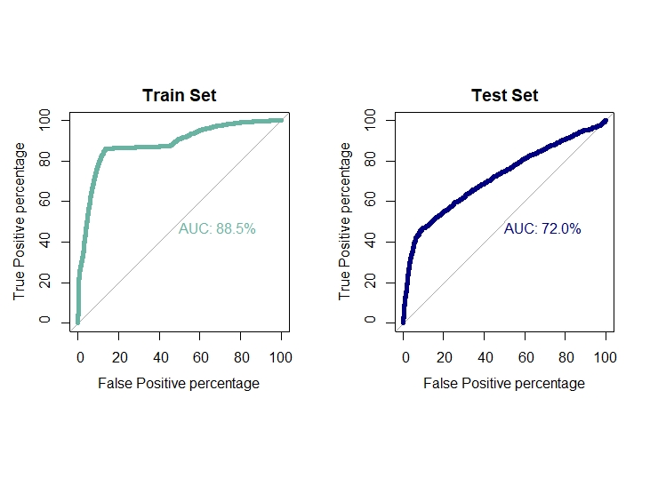
```{r}
auc1[5] = 0.885
auc2[5] = 0.670
```

## **_ARTIFICIAL NEURAL NETWORK (ANNs)_**

Artificial Neural  Networks   (ANNs)  is  a   computational  model  based  on  the  structure  and  functions  of  biological  neural network . Information   that  flows  through  the  network  affects  the structure of   the  ANN   because  a   neural  network   changes  or  learns  , in a sense -  based on that   input  and  output  .  ANNs    are  considered  non-linear  statistical  data  modeling  tools  where   the   complex  relationships   between  inputs  and  outputs  are modeled  or   pattern  are  found  .
**COMPONENTS  OF  ANNs**

*Neurons* 

ANNs are  composed  of  artificial  neural  networks  which  are  conceptually  derived  from  biological  neurons. Each  artificial neural  network   has  inputs  and  produce  output  which  can be  sent  to multiple neurons . 

*Connections  and  Weights*

The network  consists  of  connections , each  connection  providing  the  output  of one  neuron as  an input to another  neuron .To  find  the  output  of  the  neuron   , first   we  take the weighted   sum  of  all  the  inputs  ,  weighted  by the weights  of the  connections  from the inputs  to the neurons .  The weighted  sum then  passed  through  a  (usually non-linear) activation function  to produce the output .

*Propagation  Function*

The  propagation function  computes  the  input  to  a neuron from the  outputs  of  itd predecessor  neurons and  their  connections as  a weighted  sum.

*Hyperparameter*

A   hyperparameter   is  a constant   parameter  whose  value  is  a  set   before  the  learning  process  begins .  The  values   of the  parameters  are  derived  via  learning .Examples  of   the hyperparameter  includes  learning  rate , the  number of  hidden  layers and  the batch size  .
Hyperparameter  Optimization  is  a  big  part  of  deep learning . The reason  is  that   neural  networks  are notoriously   difficult   to  configure   and there  are a lot  of  parameters  that we need to  set .  on the  top  of  that  , individual  models  can  be very slow  to train. That is why  we use  the grid search  capability  to  tune  the  hyperparameters for the model.

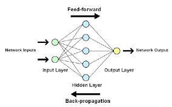

```{r}
## Artifical Neural Network Classifier ##

data.ann =cbind(quanti.norm, quali.dummy, target)
setDF(data.ann) #Converting into data.table

#Test train split in 80:20 ratio
set.seed(666) #For Reproducibility

ind=sample(nrow(data.ann),nrow(data.ann)*0.8,replace = F)
train.ann=data.ann[ind,]
test.ann=data.ann[-ind,]

registerDoParallel(cl)

## Tuning Hyperparameters for ANN
set.seed(666)
param = trainControl(method = "cv",number = 5 , allowParallel = T,classProbs = T,summaryFunction = twoClassSummary,search = "grid")
ann.fit = train(recode_factor( target,'0'="no",'1'="yes")~., train.ann,
                method = "nnet",
                trControl = param,
                metric = "ROC",
                trace = FALSE,
                maxit = 200)

# Stop parallel Computation
stopCluster(cl)
registerDoSEQ()

#getModelInfo()$nnet

ann.fit$bestTune

[1] size decay
    3   0.1
    
plot(ann.fit)
```
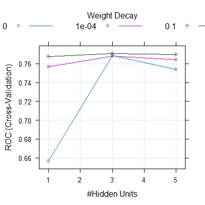
```{r}
## Model Fitting based on the Grid Search
set.seed(666)
model.ann = nnet(target~., data = train.ann, size =3, decay = 0.1,maxit=200)

## For Test Set
pred.ann.prob = predict(model.ann, newdata= test.ann[,-88])
pred.ann = ifelse(pred.ann.prob > 0.5, "1", "0" )
conf6 = table(predict= pred.ann , true = test.ann$target)
err2[6] = (conf6[1,2]+conf6[2,1])/sum(conf6)


#For Training Set

pred.ann.train.prob = predict(model.ann , newdata = train.ann[,-88])
pred.ann.train = ifelse(pred.ann.train.prob > 0.5, "1", "0" )
conf6.train = table(predicted = pred.ann.train, true = train.ann$target)
err1[6] = 1-sum(diag(conf6.train))/sum(conf6.train)

#ROC curve and AUC value
par(mfrow=c(1,2))
par(pty="s")

roc(train.ann$target , pred.ann.train.prob , plot = T,col = "#69b3a2", print.auc = T, legacy.axes = TRUE , percent = T,
    xlab = "False Positive percentage", ylab = "True Positive percentage",lwd = 5, main = "Train Set")

roc(test.ann$target , pred.ann.prob , plot = T,col = "navyblue", print.auc = T, legacy.axes = TRUE , percent = T,
    xlab = "False Positive percentage", ylab = "True Positive percentage",lwd = 5, main = "Test Set")
    
auc1[6] = auc(train.ann$target , pred.ann.train.prob)
auc2[6] = auc(test.ann$target , pred.ann.prob)      
```
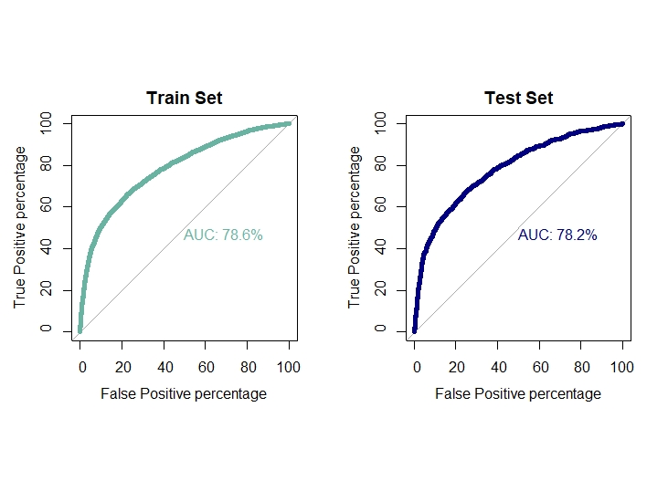


## **_Evaluation of Classification Performances_**

To evaluate the classification performances of the six aforementioned models we employed the following measures:
*	Error rate for training set
*	Error rate for test/validation set
*	Area under ROC for training set
*	Area under ROC for test set

```{r}
## Classification Evaluation for the above six models##
classification.eval=data.frame(Model=c("Logistic","LDA","KNN","XGBoost","SVM","ANN"),Train.Error=err1,
                               Validation.Error=err2, Train.AUC=auc1, Validation.AUC=auc2)
classification.eval
```
```{r}
     Model Train.Error Validation.Error Train.AUC Validation.AUC
1 Logistic   0.1778750        0.1800000 0.7720000      0.7690000
2      LDA   0.1785417        0.1783333 0.7700000      0.7680000
3      KNN   0.1767083        0.1767083 0.8140000      0.7510000
4  XGBoost   0.1521250        0.1683333 0.8740000      0.7850000
5      SVM   0.1606250        0.1721667 0.8850000      0.6700000
6      ANN   0.1765000        0.1716667 0.7792848      0.7755674
```
From the above table, it can be observed that the model *XGBoost* has minimum error rate for test and train set and maximum AUC for train and test set. Hence, XGBoost classifier has definitely performed best among the six models as far as classification is concerned.

## **_Sorting Smoothing Method_**

Earlier we have compared the six models based on the measures like error rate and AUC. And observed that XGBoost has performed better than the other five models in terms of least error rate and maximum AUC. However, in risk management study the confidence of a model on an individual sample to belong to the class predicted by the model is of far more significance rather than just binary classification results like, ‘default’ or ‘non-default’. By the term ‘confidence’, we mean the accuracy of predicted probability of default.

Since the real probability of default is unknown, the ‘Sorting Smoothing Method’, SSM is employed here to estimate the real probability of default.
Firstly, according to the predictive probability from a model we sort the validation or test set in ascending order. Then SSM is used to estimate real probability as follows:

Pi=(Yi-n+……+Yi-1+Yi+Yi+1+…..+Yi+n )/(2*n+1)

Pi=Estimated real probability of default for ith ordered sample in test set

Yi= ith order value of the binary response variable

And, n= number of data for smoothing. Here we’ll use n=50.

Now treating this estimated real probability of default as real we plot a scatter plot diagram, with predicted probability from model along the X axis and the estimated real probability along the Y axis.
Then we fit a linear regression line Y=A+Bx, from the scatter plot.
Lastly, the model for which A is closest to 0, B is closest to 1 and R² is highest, is considered as the best model to represent the real probability of default.


The scatter plots of real probability of default(estimated from *Sorting Smoothing Method*)(Y) versus the predicted probability from the model (x) along with the fitted linear regression line for each of the six classifiers are as follow: 

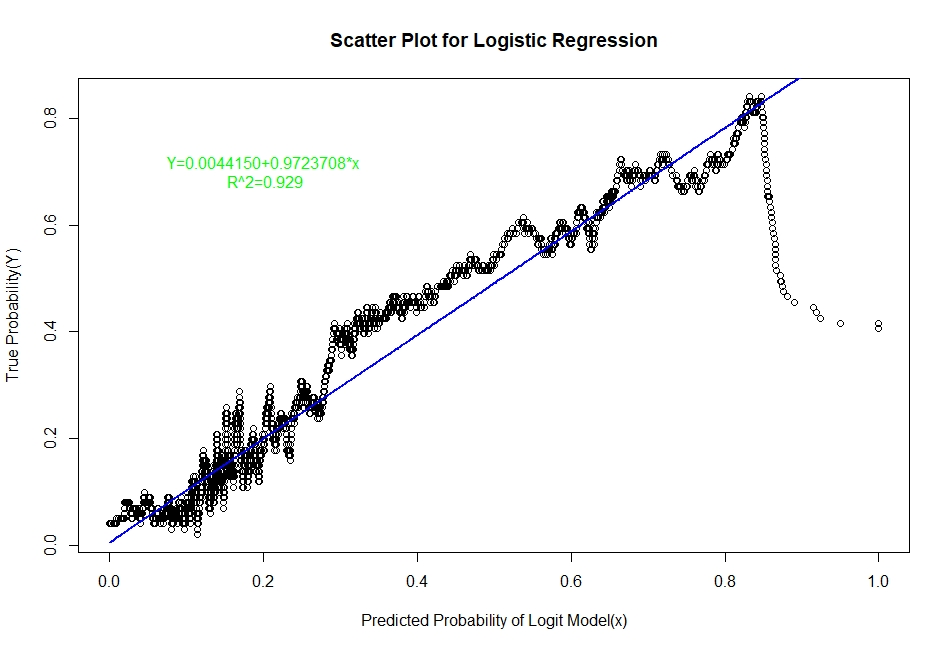
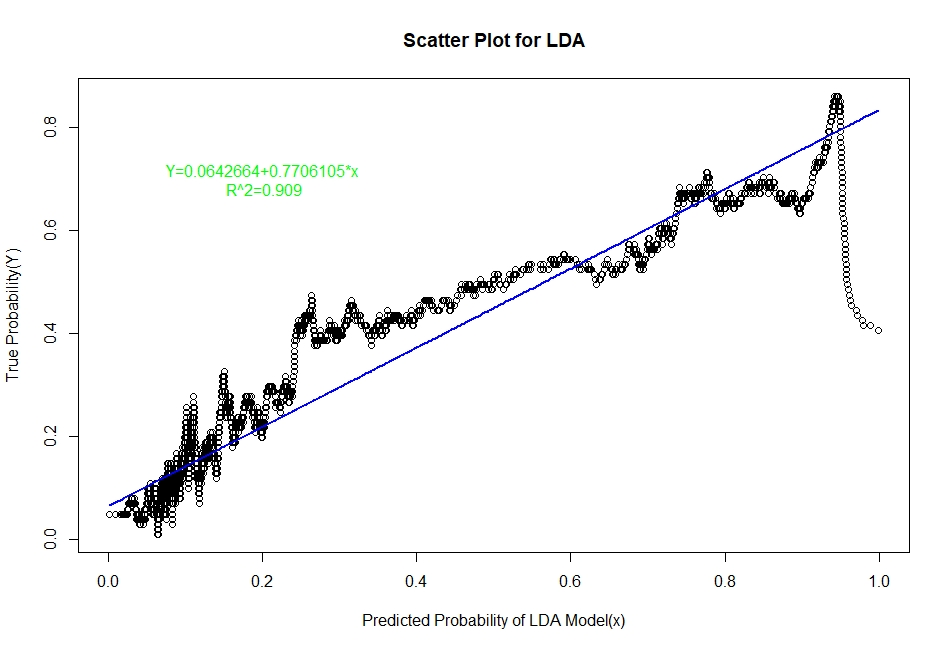
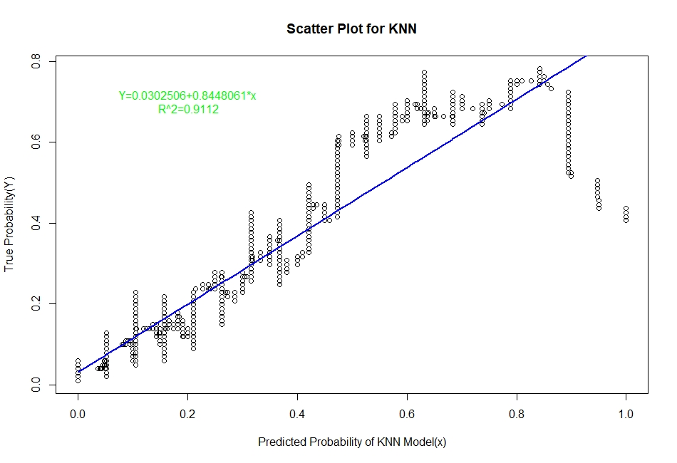
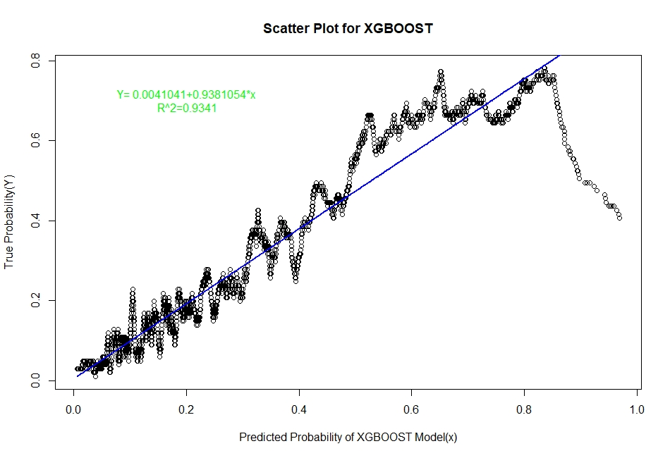
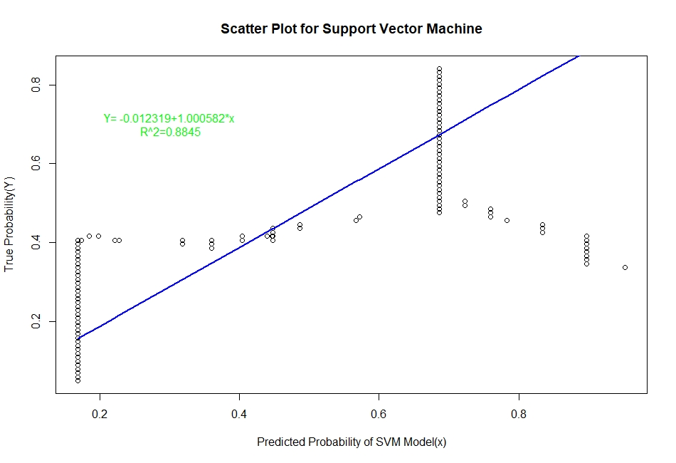
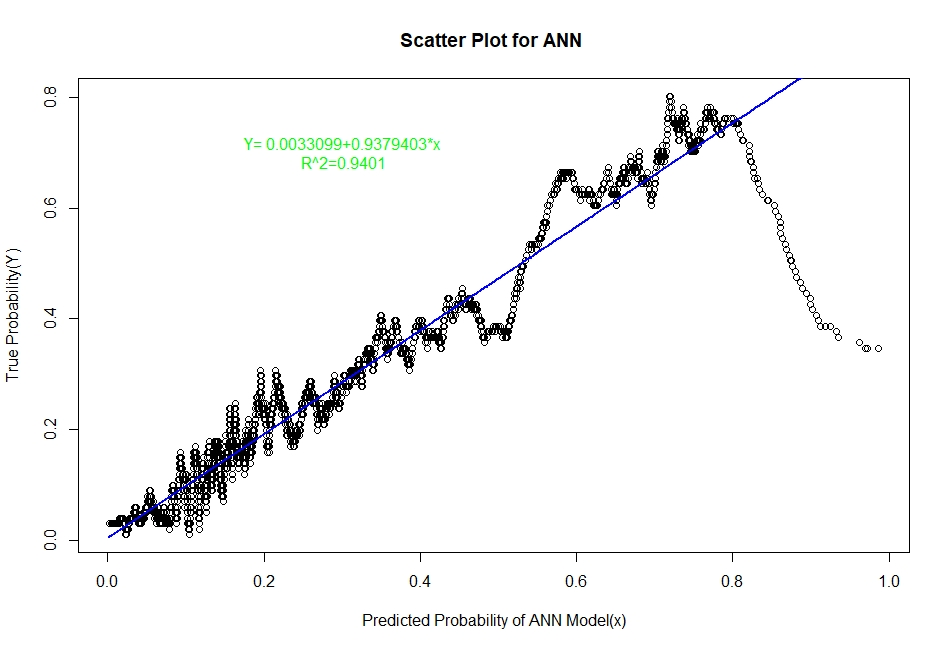

## **_Evaluation of Representation Accuracy of Real Probability of Default For The Six Classifiers_**

As mentioned above, we’ll evaluate the accuracy of predicted probabilities for the models based on the goodness of fit of the linear regression line Y=A+Bx, where Y is the estimated real probability from **Sorting Smoothing Method** and x being predicted probability from the models. The measures used are the following:
*	Intercept
*	Slope
*	Adjusted R squared

```{r}
#Model evaluation table ##
Prediction.eval=data.frame(Model=c("Logistic","LDA","KNN","XGBoost","SVM","ANN"),Intercept=c(0.00441,0.06426,0.0302506,0.0041041,-0.012319,0.0033099),
                      Slope=c(0.9724,0.7706,0.8448061,0.9381054,1.000582,0.9379403),Rsq=c(0.929,0.909,0.9112,0.9341,0.884,0.9401))
Prediction.eval
```
```{r}
     Model  Intercept     Slope    Rsq
1 Logistic  0.0044100 0.9724000 0.9290
2      LDA  0.0642600 0.7706000 0.9090
3      KNN  0.0302506 0.8448061 0.9112
4  XGBoost  0.0041041 0.9381054 0.9341
5      SVM -0.0123190 1.0005820 0.8840
6      ANN  0.0033099 0.9379403 0.9401
```
From the above table it is clear that for the **ANN** classifier the intercept A is closest to zero and R² is highest and slope B is also quite close to 1. Therefore, the **Artificial Neural Network model** represents the real probability of default the best.

## **_Summary of The Project_**

Among the six aforementioned classification techniques, the tree based boosting model i.e **XGBoost** has performed the best in terms of classification task based on error rate, and AUC measure. The differences among the error rates for the methods are not very significant, more or less same; however, the areas under ROC curve are quite distinct and our case AUC is of more significance in terms of accuracy since the target class that is default, has a very small proportion. XGBoost by nature generally performs very well for structured or tabular data and it has done so on our dataset as expected.

On the other hand, in terms of prediction accuracy of probability of default, the method produced by **Artificial Neural Networks (ANNs)** outperforms the other five classification techniques in terms of highest R squared value, regression coefficient (closest to 1) and intercept (closest to zero). Therefore, the classification technique derived from ANNs represents the real probability of default better than the other methods such as discriminant analysis, KNN. In general, ANN performs well in the area of pattern recognition and in a sense; this method has done exactly that, distinguishing a kind of pattern among the clients with credit card, default and non-default, by *representing the real probability of default* which is more important in risk analysis than just binary classification.


